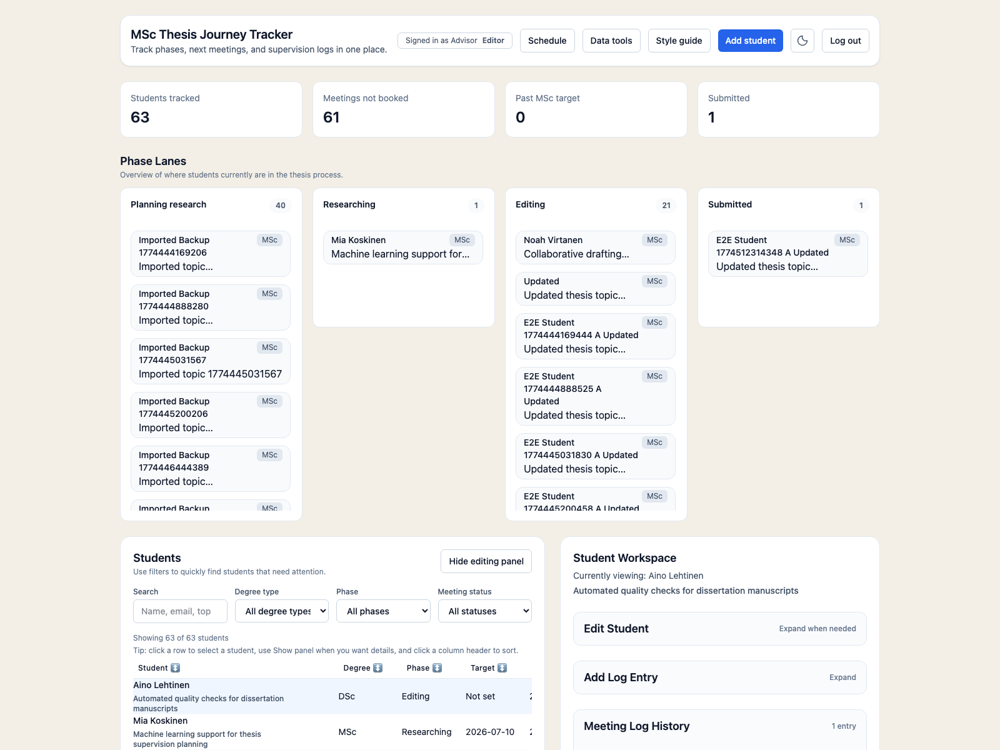
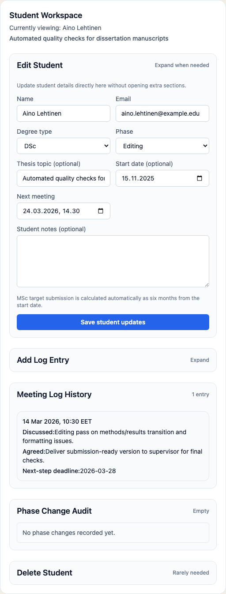

# Thesis Journey Tracker

Thesis Journey Tracker is a private advising dashboard for following students as they move through a thesis process. It is built for small supervision teams: you can keep track of thesis phases, upcoming meetings, thesis topics, and supervision notes in one place, with editor or readonly access per account.

The project is intentionally small and server-rendered. It runs on Cloudflare Workers with D1 for storage, so it stays lightweight while still being easy to deploy.

## Screenshots

<table>
  <tr>
    <td width="70%">
      
    </td>
    <td width="30%">
      
    </td>
  </tr>
  <tr>
    <td>
      <strong>Dashboard overview</strong><br />
      Track students by phase, scan upcoming supervision work, and open a focused workspace without leaving the main dashboard.
    </td>
    <td>
      <strong>Student workspace</strong><br />
      Update thesis details, add supervision notes, and review recent meeting history in one place.
    </td>
  </tr>
</table>

## Why This Project Exists

- Keep thesis supervision work organized without relying on spreadsheets or scattered notes.
- See where students are in the process at a glance.
- Record meeting outcomes and next steps in a format that is easy to revisit later.

## What You Can Do With It

- Add students with degree type, thesis topic, and timeline information.
- Track each student through thesis phases from planning to submission.
- Store supervision logs with discussion notes and action items.
- Follow upcoming meetings from the dashboard.
- Filter the student list by phase, degree type, and meeting status.
- Open a weekly Google Calendar scheduling view, see existing events, and send meeting invites to students. If you want a lower-friction setup, the app also supports a read-only Google Calendar iCal fallback for availability.
- Export or restore the dataset as JSON backups, and download an email-ready Markdown status report.
- Store automated Cloudflare backups in R2 when deployed with the scheduled backup setup.

## Quick Start

Prerequisites:

- Node.js 20 or newer
- npm
- A Cloudflare account with Wrangler access

1. Install dependencies:

```bash
npm install
```

2. Create the D1 database:

```bash
npx wrangler d1 create thesis_tracker_db
```

This command returns a `database_id` for the Cloudflare D1 database. Put that value into [`wrangler.toml`](./wrangler.toml). Local development will then use Wrangler's local D1 state while pointing at the same database configuration.

3. Create local secrets:

```bash
cp .dev.vars.example .dev.vars
```

Set `SESSION_SECRET` in `.dev.vars` to a long random string before starting the app. If you want the scheduling page to connect to Google Calendar, follow the Google credential walkthrough in [docs/setup.md#optional-get-google-calendar-integration-values](./docs/setup.md#optional-get-google-calendar-integration-values), then save those values from the app's Data Tools page, where they are encrypted before being written to D1.

4. Apply migrations and create your first account:

```bash
npm run db:migrate
npm run account:create -- --name "Advisor" --password "change-this-password" --role editor
```

Optional: load a small sample dataset into your local D1 database:

```bash
npm run db:seed:sample
```

5. Start the app:

```bash
npm run dev
```

Wrangler will print the local URL, typically `http://127.0.0.1:8787`.

To add more accounts later, run the same script again with a different `name` and `role`:

```bash
npm run account:create -- --name "Professor" --password "change-this-password" --role readonly
```

By default this writes to the local D1 database. Add `--remote` if you want to create an account in the deployed database instead.

If you created accounts earlier with the older `210000` PBKDF2 default, run the same `account:create` command again for each affected account to rewrite the stored hash with the Cloudflare-compatible `100000` iteration default.

The sample-data seed is local-only and idempotent: running `npm run db:seed:sample` again will skip entries that already exist.

For the full setup flow, see [docs/setup.md](./docs/setup.md).

## Documentation

- [AGENTS.md](./AGENTS.md): durable repo-specific rules for automated contributors
- [docs/setup.md](./docs/setup.md): local setup, environment variables, and first run
- [docs/development.md](./docs/development.md): scripts, testing, editor support, and day-to-day development notes
- [docs/deployment.md](./docs/deployment.md): CI, production deployment, and security notes
- [docs/project-structure.md](./docs/project-structure.md): tech stack, architecture, and directory map
- [docs/backups.md](./docs/backups.md): automated R2 backups, restore flow, and retention notes
- [docs/performance-plan.md](./docs/performance-plan.md): Lighthouse baseline and performance follow-up plan
- [docs/roadmap.md](./docs/roadmap.md): future feature ideas and likely next steps

## Tech Snapshot

- Cloudflare Workers for runtime and hosting
- Cloudflare D1 for persistence
- Cloudflare R2 for optional scheduled backups
- TypeScript throughout the app
- HTMLisp for server-rendered views
- Tailwind CSS for styling

## First-Time Reader Notes

- This is a private, password-protected app with lightweight role-based access rather than a multi-tenant SaaS product.
- Auth accounts now live in the D1 database, with a tiny CLI helper for creating editor and readonly users.
- Repeated failed login attempts are temporarily rate-limited per client IP.
- The UI is server-rendered and deliberately simple.
- Seeded mock students are only used in the isolated end-to-end test environment.

If you want to understand how the codebase is organized before diving in, start with [docs/project-structure.md](./docs/project-structure.md).
