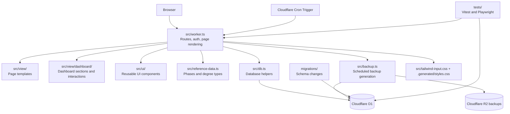

# Project Structure

This document gives a technical overview of how the project is put together.

## Stack

- Cloudflare Workers for the runtime and hosting layer
- Cloudflare D1 as the SQLite-backed database
- TypeScript for application code
- HTMLisp for server-rendered HTML views
- Tailwind CSS for styling
- Playwright and Vitest for testing

## Architecture At A Glance

- [`src/worker.ts`](../src/worker.ts): route handling, auth, rendering, and core app logic
- [`src/backup.ts`](../src/backup.ts): scheduled R2 backup generation and object layout
- [`src/reference-data.ts`](../src/reference-data.ts): shared thesis phase and degree reference data
- [`src/view/`](../src/view): page and partial rendering helpers
- [`src/view/dashboard/`](../src/view/dashboard): dashboard-specific sections and interactions
- [`src/view/data-tools.htmlisp.ts`](../src/view/data-tools.htmlisp.ts): backup import/export page
- [`src/ui/`](../src/ui): reusable UI components and styling helpers
- [`src/db.ts`](../src/db.ts): database access helpers
- [`migrations/`](../migrations): schema changes for D1
- [`tests/`](../tests): end-to-end and security-oriented automated tests

## Architecture Diagram

The Worker is the center of the app: it handles requests, checks authentication, talks to D1 through the database helpers, renders server-side HTML using the shared view and UI layers, and can run scheduled backups into R2 when deployed on Cloudflare.

Authentication remains intentionally lightweight: accounts are stored in the `app_users` D1 table with hashed passwords, and the Worker stores the signed session together with the viewer role (`editor` or `readonly`) in an `HttpOnly` cookie. Legacy `APP_USERS_JSON` or `APP_PASSWORD` values are only used as a one-time bootstrap path when the auth table is still empty.

## Repository Map

- [`README.md`](../README.md): first-stop overview for new readers
- [`docs/`](./README.md): technical documentation
- [`editor-support/vscode-htmlisp/`](../editor-support/vscode-htmlisp): local VS Code extension for HTMLisp syntax support
- [`scripts/run-lighthouse.mjs`](../scripts/run-lighthouse.mjs): Lighthouse automation
- [`playwright.config.ts`](../playwright.config.ts): end-to-end test configuration
- [`vitest.config.ts`](../vitest.config.ts): unit and integration test configuration
- [`tailwind.config.cjs`](../tailwind.config.cjs): Tailwind scanning and theme setup

## Data And Environment Notes

- Local secrets are kept in `.dev.vars`.
- Runtime accounts are stored in D1 instead of environment variables.
- Test-only seeded data lives in [`tests/e2e/mock-data.sql`](../tests/e2e/mock-data.sql).
- Seeded mock students are isolated to the E2E environment and are not part of the normal local app data.
