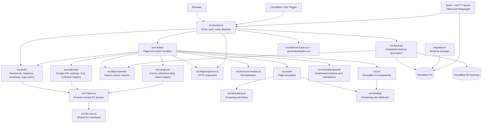

# Project Structure

This document gives a technical overview of how the project is put together.

## Stack

- Cloudflare Workers for the runtime and hosting layer
- Cloudflare D1 as the SQLite-backed database
- TypeScript for application code
- HTMLisp for server-rendered HTML views
- Tailwind CSS v4 for styling
- Playwright and Vitest for testing

## Architecture At A Glance

- [`src/worker.ts`](../src/worker.ts): thin Worker entrypoint for request/session setup, auth flow, and route dispatch
- [`src/routes/`](../src/routes): page and form-action handlers grouped by feature area
- [`src/auth/`](../src/auth): reusable authentication primitives for password hashing, session cookies/tokens, auth bootstrap, and login policy
- [`src/calendar/`](../src/calendar): shared calendar feature code for Google API access, encrypted settings, iCal parsing, and schedule-building helpers
- [`src/data-transfer/`](../src/data-transfer): shared export/import/report generation used by data tools and automated backups
- [`src/students/`](../src/students): shared student-domain code for forms, degree/phase reference data, and derived progress/status helpers
- [`src/auth/store.ts`](../src/auth/store.ts), [`src/calendar/store.ts`](../src/calendar/store.ts), and [`src/students/store.ts`](../src/students/store.ts): feature-owned D1 persistence modules
- [`src/db-core.ts`](../src/db-core.ts): shared D1 interfaces and tiny persistence helpers used by the feature-owned stores
- [`src/http/response.ts`](../src/http/response.ts): HTTP response and redirect helpers for Worker routes
- [`src/forms/normalize.ts`](../src/forms/normalize.ts): shared form and payload normalization helpers
- [`src/formatting.ts`](../src/formatting.ts): shared escaping and date-formatting helpers for views and HTMLisp rendering
- [`src/routes/dashboard/`](../src/routes/dashboard): the dashboard slice, split into render handlers, actions, and filter/path helpers
- [`src/routes/schedule/`](../src/routes/schedule): the scheduling slice, split into render handlers, actions, and schedule path helpers
- [`src/routes/data-tools/`](../src/routes/data-tools): the data-tools slice, including route handlers and co-located tests
- [`src/backup/`](../src/backup): scheduled R2 backup generation, storage helpers, and co-located tests
- [`src/htmlisp/`](../src/htmlisp): shared HTMLisp rendering, types, and attribute helper utilities
- [`src/view/`](../src/view): page and partial rendering helpers
- [`src/view/dashboard/`](../src/view/dashboard): dashboard-specific sections and interactions
- [`src/view/data-tools.htmlisp.ts`](../src/view/data-tools.htmlisp.ts): backup import/export page
- [`src/ui/`](../src/ui): reusable UI components and styling helpers
- [`migrations/`](../migrations): schema changes for D1
- [`tests/`](../tests): end-to-end tests plus shared test helpers and broader integration/security coverage
- [`src/routes/*.test.ts`](../src/routes): co-located Vitest coverage for route modules such as auth, scheduling, and data tools

## Architecture Diagram

The Worker is now intentionally thin: it handles request/session setup, authentication, and route dispatch. Feature-specific page rendering and form-action behavior live under [`src/routes/`](../src/routes), where handlers talk to D1 through feature-owned store modules, render server-side HTML through the shared view/UI layers, and rely on shared feature modules such as [`src/auth/`](../src/auth) for reusable authentication concerns, [`src/calendar/`](../src/calendar) for Google Calendar access and schedule-building logic, [`src/students/`](../src/students) for shared student forms and status rules, and [`src/data-transfer/`](../src/data-transfer) for import/export/report generation shared with automated backups. Shared D1 interfaces now live in [`src/db-core.ts`](../src/db-core.ts), while focused support code is split between [`src/http/response.ts`](../src/http/response.ts), [`src/forms/normalize.ts`](../src/forms/normalize.ts), and [`src/formatting.ts`](../src/formatting.ts).

Authentication remains intentionally lightweight: accounts are stored in the `app_users` D1 table with hashed passwords, and the Worker stores the signed session together with the viewer role (`editor` or `readonly`) in an `HttpOnly` cookie. Legacy `APP_USERS_JSON` or `APP_PASSWORD` values are only used as a one-time bootstrap path when the auth table is still empty.

## Repository Map

- [`README.md`](../README.md): first-stop overview for new readers
- [`docs/`](./README.md): technical documentation
- [`editor-support/vscode-htmlisp/`](../editor-support/vscode-htmlisp): local VS Code extension for HTMLisp syntax support
- [`scripts/run-lighthouse.mjs`](../scripts/run-lighthouse.mjs): Lighthouse automation
- [`playwright.config.ts`](../playwright.config.ts): end-to-end test configuration
- [`vitest.config.ts`](../vitest.config.ts): unit and integration test configuration
- [`src/tailwind-input.css`](../src/tailwind-input.css): Tailwind v4 entrypoint, theme tokens, and custom variant definitions

## Data And Environment Notes

- Local secrets are kept in `.dev.vars`.
- Runtime accounts are stored in D1 instead of environment variables.
- Test-only seeded data lives in [`tests/e2e/mock-data.sql`](../tests/e2e/mock-data.sql).
- Seeded mock students are isolated to the E2E environment and are not part of the normal local app data.
